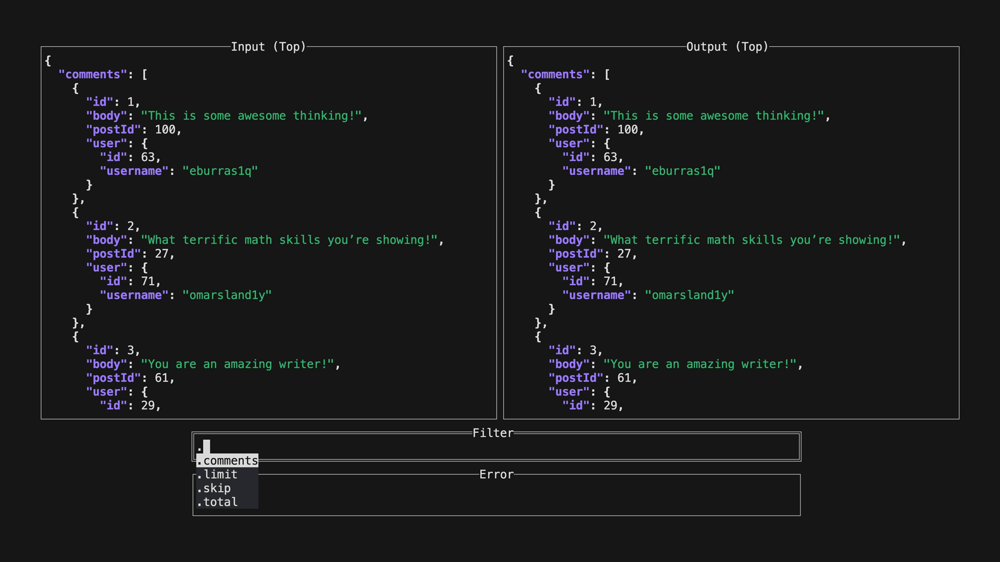

ijq
===

Interactive `jq` tool. Like [jqplay] for the commandline.

[jqplay]: https://jqplay.org

Demo
----

Installation
------------

### Install from package manager

### Build from source

Install [go]. To install `ijq` under `/usr/local/bin/` simply run

    make install

from the root of the project. To install to another location, set the `PREFIX`
variable, e.g.

    make PREFIX=~/.local install

To generate the man page you will also need to have [scdoc] installed.

[go]: https://golang.org/dl/
[scdoc]: https://sr.ht/~sircmpwn/scdoc

Usage
-----

ijq uses [jq] under the hood, so make sure you have that installed first.

Read from a file:

    ijq file.json

Read from stdin:

    curl -s https://api.github.com/users/gpanders | ijq

Press `Return` to close `ijq` and print the current filtered output to stdout.
This will also print the current filter to stderr. This allows you to save the
filter for re-use with `jq` in the future:

    ijq file.json 2>filter.jq

    # Same output as above
    jq -f filter.jq file.json

Pressing `Return` also saves the filter to a history file
(`$XDG_DATA_HOME/ijq/history` by default). You can browse the history by
deleting everything in the filter field. Change the history file used with the
`-H` option, or specify an empty string to disable history entirely (i.e. `-H
''`).

If `$XDG_DATA_HOME` is undefined, then the directory used is [platform
dependent][xdg].

Use `Shift` plus the arrow keys to move between the different windows. When
either of the input or output views have focus, you can use the arrow keys to
scroll up and down. Vi keys also work, i.e. you can use `j`/`k` to scroll up or
down, `g` to move to the top of the view, `G` to jump to the bottom of the
view, and `Ctrl-F`/`Ctrl-B` to scroll up or down a page at a time.

Use `Ctrl-C` to exit `ijq` immediately, discarding all filters and state.

You can configure the colors by setting the `JQ_COLORS` environment variable.
See the [jq documentation][colors] for more details.

[jq]: https://jqlang.github.io/jq/
[colors]: https://jqlang.github.io/jq/manual/#colors
[xdg]: https://github.com/kyoh86/xdg#xdg-base-directory

Contributing
------------

Bugs can be reported on the [issue tracker][issues]. PRs are accepted on
[GitHub][github] or [Codeberg][codeberg].

[issues]: https://codeberg.org/gpanders/ijq/issues
[github]: https://github.com/gpanders/ijq
[codeberg]: https://codeberg.org/gpanders/ijq

Note for Packagers
------------------

Subscribe to release announcements on [Codeberg][codeberg] to be notified of
new releases, or subscribe to the [RSS
feed](https://codeberg.org/gpanders/ijq/releases.rss).

Similar Work
------------

- [jqplay]
- [vim-jqplay]

[vim-jqplay]: https://github.com/bfrg/vim-jqplay

License
-------

[GPLv3](https://www.gnu.org/licenses/gpl-3.0.en.html)
